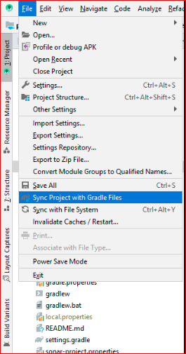
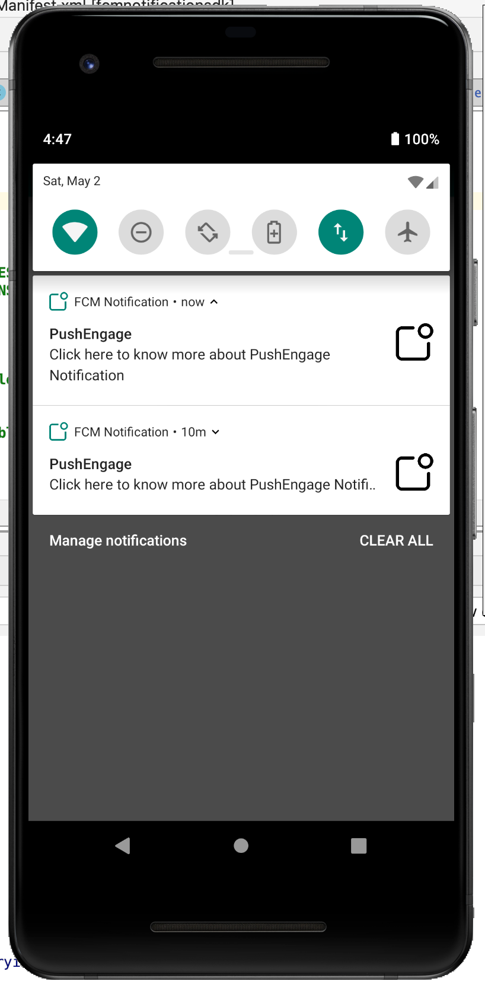
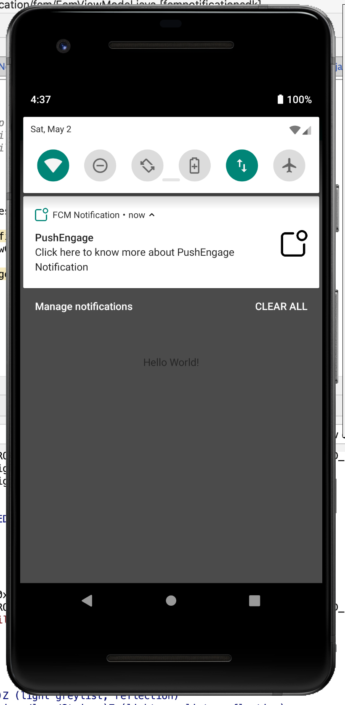

FCM Notification SDK with Demo App

**How to Setup the FCM Notification SDK ?**

1. Add the dependency of Notification list with version in build.gradle

    ```
    generate the aar file and put it in lib directory
    paste below link in app level gradle
    ```

   `implentation(name:'fcmnotification-release',ext:'aar')`

2. Setup project on Firebase and create a google-service.json and put it in your app
   `apply plugin: 'com.google.gms.google-services`

3. Sync the Project File->Sync Project with Gradle File.

   

4. init FcmNotificationSDK pass the context and class name which is use on click of notification

5. implement the FcmObserver class to listen observer method to get updated token, notification is visible ot not

**FCM Notification Discription**

1. we have use FcmNotificationSDK.java as singleton class to init sdk.

2. Firebase Version used below

**Dependencies  Used:**

'implementation 'com.google.firebase:firebase-messaging:20.1.6'

### FcmNotificationSDK.java

​```
private Context context;
private Class<?> showClass;
private static FcmNotificationSDK INSTANCE = null;
private FcmObserver observer;
​```


### FcmService.java

To listen the latest token and message received for FirebaseMessagingService


##### Screens in Demo App:

Get Upload Assest and Merchant logo list screen



